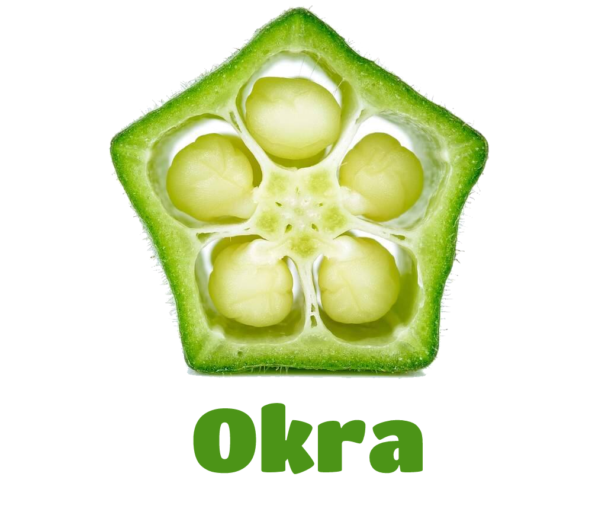

# 

AR end to end solution for customers dining in a restaurant

[About The Project](#about-the-project) • [How To Use](#how-to-use) • [Credits](#credits)

---

## About The Project

Okra is an innovative Augmented Reality (AR) end to end solution for customers dining in a restaurant. It allows you to scan an image on your restaurant table and pull up their menu on your camera view. Customers are able to place 3D objects on their table and order right from the app!

### Tech

- Viro Media
- React-Native

---

## How To Use

lorem ipsum

---

## Credits

- Credit to the team [Albina Usmanova](https://github.com/Lighein), [Andrew Bloodworth](https://github.com/AndrewBloodworth), [Mohamed Adam](https://github.com/MoAdam10), and [Sung Paik](https://github.com/spaik11) for their outstanding dedication and countless late nights to be able to make this vision come to _augmented_ reality.
- Thanks to our instructors [Gary Kertis](https://github.com/GaryKertis) and [Sarah Zhao](https://github.com/sarahzhao25) for constantly challenging us to create the best user experience.
